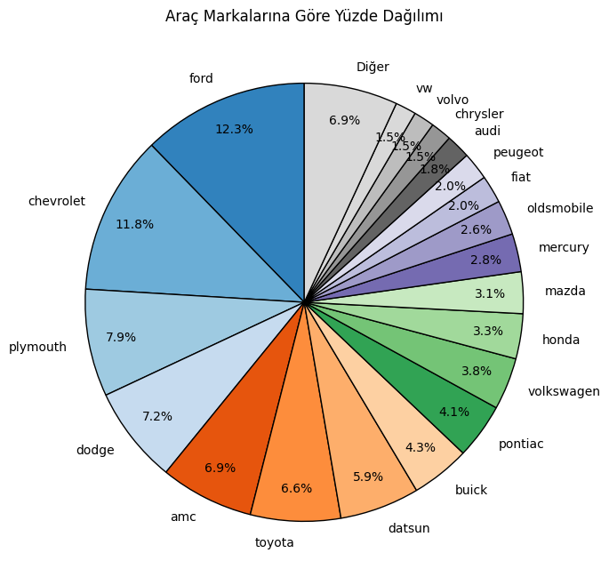
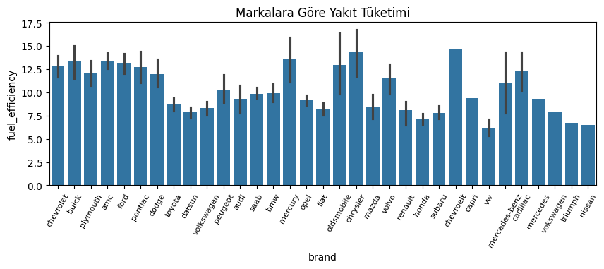
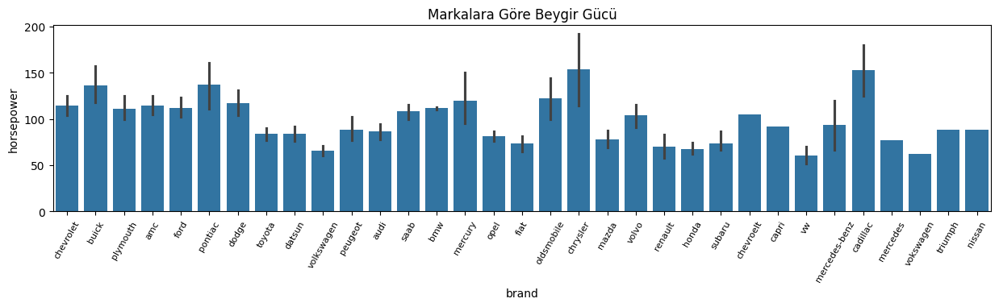

# Car Information Analysis
### Proje Genel Bakış
---
Automobile.csv verisini analiz ederek veri setimizdeki yakıt tüketimi, yıl, ağırlık, marka gibi değişkenler hakkında bilgiler edinip çıkarımların elde edilmesi

### Veri Kaynağı
Analiz için kullandığımız veri seti "Automobile.csv" dosyasıdır. Bu veri seti çeşitli araçlara  ait beygir gücü, ağırlık, yakıt tüketimi, motor hacmi, hızlanma, silindir, menşei, üretim yılları verilerini içermektedir.
- [Veri setinin Kaggle sayfası](https://www.kaggle.com/datasets/tawfikelmetwally/automobile-dataset)
### Veri Temizliği ve Hazırlığı
1. Veri yüklenip incelediğinde ilk olarak analizimi çeşitlendirmek amacıyla name değişkeninden yeni bir "brand" değişkeni oluşturuldu. Bu sayede araçların markaları baz alınarak çeşitli çıkarımların yapılabilmesi sağlandı.
2. "mpg" değişkenindeki değerler metrik bir değer olan "100km/l" değerine çevirildi. Değişekenin ismi "fuel_efficiency" olarak değiştirildi.
3. "displacment" değişkenindeki değerler metrik bir değer olan "litre" değerine çevirildi. Değişkenin ismi "displacement(L)" olarak değiştirildi.
4. "weight" değişkenindeki değerler metrik bir değer olan "kg" değerine çevirildi. Değişkenin ismi "weight(kg)" olarak değiştirildi.
5. "brand" değişkenindeki "toyouta,maxda,hi" gibi yanlış değerler değiştirildi.
### Keşifsel Veri Analizi (EDA)
EDA, araç verilerini keşfederek aşağıdaki soruları yanıtlamayı içeriyordu:
1. Veri setindeki araçların markalara göre yüzdelik dağılışları nasıldır?
2. Yıllara göre ortalama yakıt tüketim değerleri nasıl değişmiştir?
3. Motor hacminin yakıt tüketimi üzerindeki etkisi nasıldır?
4. Markalara göre ortalama yakıt tüketim değerleri nedir?
5. Beygir gücünün ortalama yakıt tüketimi üzerindeki etkisi nedir?
6. Markalara göre ortalama beygir gücü değerleri nedir?
7. Yıllara göre beygir gücü değerleri nasıl değişmiştir?
8. Menşei ülkelere göre ortalama yakıt tüketim değerleri nedir?
9. Menşei ülkelere göre ortalama motor hacim değerleri nedir?
10. Ağırlığın yakıt tüketimi üzerindeki etkisi nedir?
### Sonuçlar/Bulgular
#### Tanımlayıcı İstatistikler
  
#### Korelasyonlar
  
#### Bulgular
- Aşağıdaki grafik incelendiğinde, veri setindeki araçların çoğunluğu ford markadır.
   

- Aşağıdaki grafik incelendiğinde, yakıt tüketim değerleri yıllar içerisinde düşüş eğilimi göstermiştir.
  
   
- Aşağıdaki grafik ve korelasyon tablomuz incelendiğinde motor hacminin yakıt tüketimi üzerinde ciddi bir etkisi vardır.
  
   
- Aşağıdaki grafik ve veri setindeki değerler incelendiğinde, yakıt tüketim değerleri en yüksek olan araç markası "chevrolet" iken en düşük olanı "vw" marka araçlardır.
  
   
- Aşağıdaki grafik ve korelasyon tablomuz incelendiğinde beygir gücünün yakıt tüketimi üzerinde ciddi bir etkisi vardır.
  
   
- Aşağıdaki grafik ve veri setindeki değerler incelendiğinde en yüksek beygir gücüne sahip araçlar "chrysler" markadır.
  
   
- Aşağıdaki grafik incelendiğinde, yıllar içerisinde beygir gücü azalma eğilimi göstermiştir.
  
   
- Aşağıdaki grafik incelendiğinde, ortalama yakıt tüketimi en yüksek olan menşei ülke "usa" iken en düşük olan ise "japan" olarak karşımıza çıkmıştır.
  
   
- Aşağıdaki grafik incelendiğinde ortalama motor hacmi en yüksek olan menşei ülke açık ara "usa" olarak gözükmektedir.
  
   
- Aşağıdaki grafik ve korelasyon tablomuz incelendiğinde, yakıt tüketimi üzerindeki en yüksek etkiyi gösteren değişken "weight(kg)" değişkenidir.
  
   
  
