# **Car Information Analysis**
### **Project Overview**
---
By analyzing the **Automobile.csv** dataset, insights and conclusions are drawn about variables such as fuel consumption, year, weight, and brand.

### Data Source
The dataset used for this analysis is the **"Automobile.csv"** file. This dataset contains information on various cars, including **horsepower**, **weight**, **fuel consumption**, **engine displacement**, **acceleration**, **cylinders**, **origin**, and **production years**.
- [**Dataset's Kaggle page**](https://www.kaggle.com/datasets/tawfikelmetwally/automobile-dataset)

### Data Cleaning and Preparation
1. After loading and inspecting the data, a new **"brand"** variable was created from the **name** variable to enhance the analysis. This allowed for more meaningful insights based on car brands.
2. The values in the **"mpg"** variable were converted into the metric value of **"100km/l"**. The variable name was changed to **"fuel_efficiency"**.
3. The values in the **"displacement"** variable were converted into the metric value of **"liters"**. The variable name was changed to **"displacement(L)"**.
4. The values in the **"weight"** variable were converted into the metric value of **"kg"**. The variable name was changed to **"weight(kg)"**.
5. Incorrect values in the **"brand"** variable such as **"toyouta, maxda, chevroelt, mercedes, vokswagen, vw"** were corrected.

### Exploratory Data Analysis (EDA)
EDA involved exploring the car data to answer the following questions:
1. What is the percentage distribution of car brands in the dataset?
2. How have average fuel consumption values changed over the years?
3. What is the effect of engine displacement on fuel consumption?
4. What are the average fuel consumption values for each car brand?
5. What is the effect of horsepower on average fuel consumption?
6. What are the average horsepower values for each car brand?
7. How has horsepower changed over the years?
8. What are the average fuel consumption values by country of origin?
9. What are the average engine displacement values by country of origin?
10. What is the effect of weight on fuel consumption?

### Results/Findings
#### Descriptive Statistics
 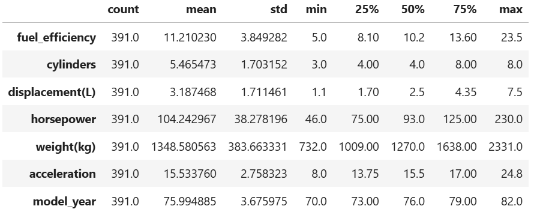 
#### Correlations
 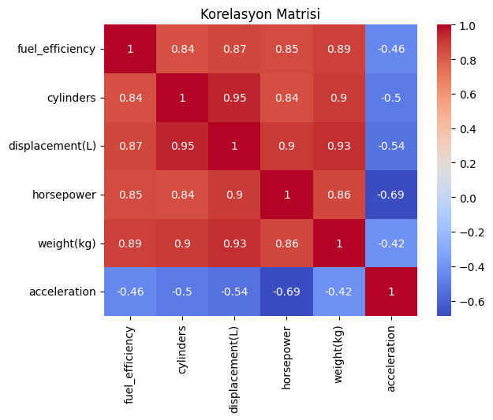 
#### Findings
- Upon reviewing the chart below, it can be seen that the majority of cars in the dataset are of the **Ford** brand.
  
  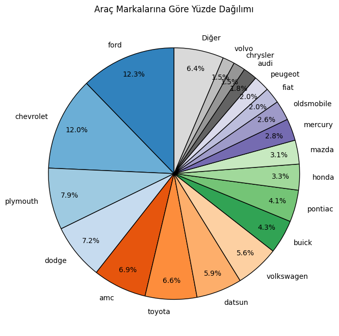 

- The chart below shows that fuel consumption values have decreased over the years.
  
  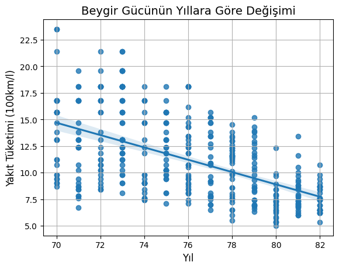 
- The chart and correlation table below indicate that engine displacement has a significant effect on fuel consumption.
  
  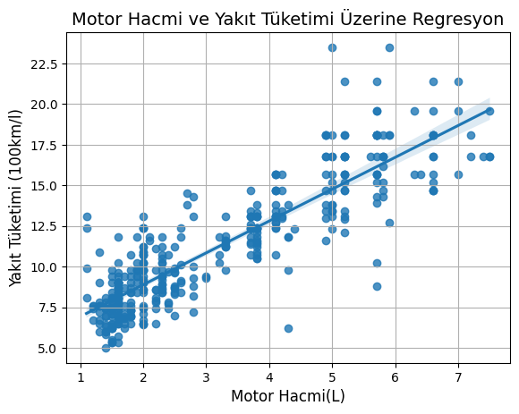 
- The chart below reveals that **Chevrolet** has the highest fuel consumption, while **Volkswagen** has the lowest.
  
  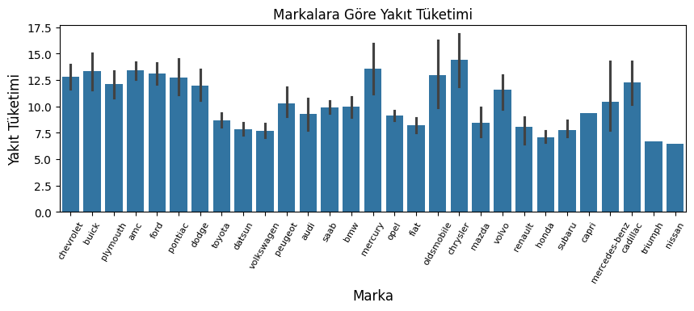 
- The chart and correlation table below show that horsepower has a significant impact on fuel consumption.
  
  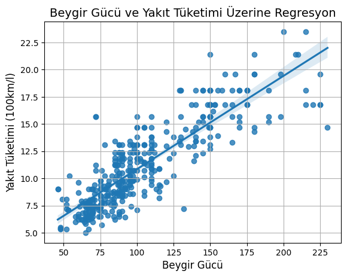 
- The chart and dataset values below indicate that **Chrysler** has the highest horsepower.
  
  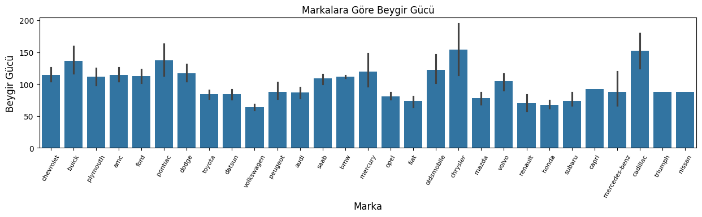 
- The chart below shows that horsepower has decreased over the years.
  
  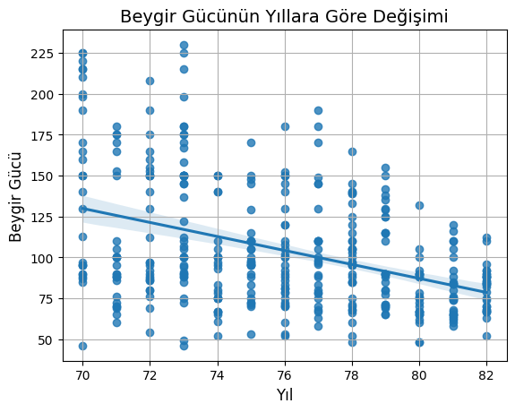 
- The chart below shows that the country of origin with the highest average fuel consumption is **USA**, while the lowest is **Japan**.
  
  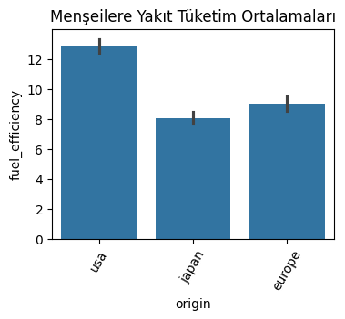 
- The chart below shows that the country of origin with the highest average engine displacement is **USA** by a wide margin.
  
  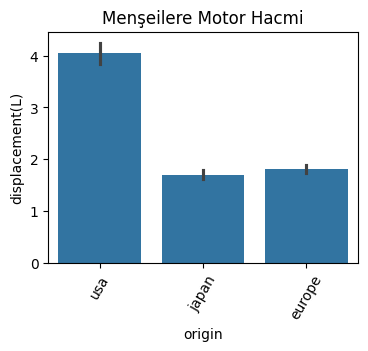 
- The chart and correlation table below reveal that **weight(kg)** has the highest impact on fuel consumption.
  
  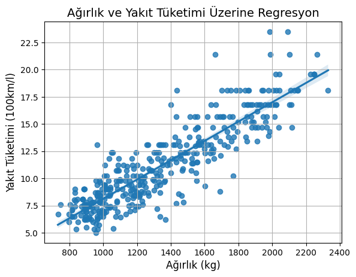 
  
### Conclusion
1. **Engine Displacement and Fuel Consumption:** As engine displacement increases, fuel consumption generally increases. Cars with larger engine displacements tend to consume more fuel.
2. **Horsepower and Fuel Consumption:** As horsepower increases, fuel consumption also tends to increase. More powerful cars tend to consume more fuel.
3. **Weight and Fuel Consumption:** As the weight of a car increases, fuel consumption also increases. Heavier cars tend to consume more fuel.
4. **Country of Origin Characteristics:** Cars from the USA tend to have higher engine displacement, horsepower, and weight, leading to higher fuel consumption. European and Japanese cars generally have lower engine displacement, horsepower, and weight, resulting in lower fuel consumption.
5. **Brand Differences:** Some brands (e.g., Chevrolet, Ford, Pontiac) have higher engine displacement, horsepower, and weight compared to other brands, which results in higher fuel consumption.
6. **Changes Over Time:** Over the years, a decrease in horsepower and fuel consumption has been observed. This can be attributed to technological advancements and improvements in emission standards, as well as the effects of the oil crises during 1970-1982, which led to more fuel-efficient engines.
7. **Correlation Analysis:** The correlation matrix shows that attributes such as engine displacement, horsepower, and weight are highly correlated with each other, and they also exhibit a strong correlation with fuel consumption.

**In summary**, the analysis of the dataset's charts reveals that car attributes like engine displacement, horsepower, and weight have a significant impact on fuel consumption, with noticeable differences across countries of origin and brands.
